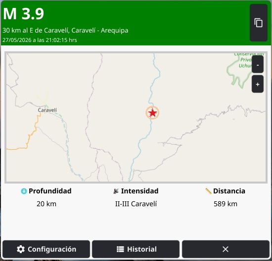

# Sismo Widget

Widget de escritorio para Windows que muestra en tiempo real el **último sismo reportado por el IGP** (Instituto Geofísico del Perú). Construido con Go y Fyne.

## Captura



## Características

- **Widget frameless** — ventana sin bordes, arrastrable con el cursor
- **Monitoreo en tiempo real** — consulta cada 10s la API pública del IGP
- **Mapa sísmico** — mapa OpenStreetMap con marcador animado en la ubicación del epicentro
- **Alertas visuales** — ventana flotante a pantalla completa cuando ocurre un sismo que supera los umbrales configurados
- **Alerta global M ≥ 6** — opción para alertar siempre que la magnitud sea ≥ 6, sin importar la distancia
- **Header dinámico** — color verde (< 4.5), amarillo (4.5–5.9) o rojo (≥ 6) según la magnitud
- **Notificaciones del sistema** — notificación nativa de Windows al detectar un sismo relevante
- **Bandera de sistema (systray)** — minimiza a la bandeja con menú contextual
- **Configuración persistente** — coordenadas, umbrales de alerta y filtros guardados en JSON
- **Historial** — ventana con los últimos 50 sismos que pasan el filtro
- **Simulacro** — botón para simular una alerta sísmica y probar la configuración
- **Sonido de alarma** — reproduce un sonido al mostrar la alerta (archivo `assets/sounds/alerta1.mp3`)
- **Selección de dispositivo de audio** — elige en qué salida de audio reproducir la alarma (solo para esta aplicación, sin afectar al sistema)
- **Instancia única** — bloquea la ejecución de una segunda instancia del programa

## Requisitos

- Windows 10 u 11 (usa APIs Win32 para ventana frameless y arrastre nativo)
- Go 1.26.3 o superior (para compilar desde código)
- Conexión a internet (API del IGP y tiles de OpenStreetMap)

## Instalación

### Desde el binario

Descarga el `.exe` de la sección [Releases](https://github.com/tavosud/sismo_widget/releases) y ejecútalo.

### Compilar desde código

```powershell
git clone https://github.com/tavosud/sismo_widget.git
cd sismo_widget
go build -ldflags "-s -w -H=windowsgui" -o SismoWidget.exe ./cmd/sismo_widget/
```

Los flags `-s -w` eliminan información de depuración (binario más pequeño) y `-H windowsgui` suprime la ventana de consola. El icono de la aplicación se incluye automáticamente gracias al archivo `resource.syso`.

## Uso

1. Al ejecutar por primera vez se abre la **ventana de configuración** (los campos de latitud/longitud aparecen vacíos y se autodetectan vía IP).
2. Configura tus coordenadas o ajústalas manualmente; define los umbrales de alerta y filtro.
3. Haz clic en **Iniciar** para abrir el widget.
4. El widget consulta la API del IGP cada 10 segundos y muestra el último sismo.
5. Para salir definitivamente, usa el botón **Cerrar** o la opción **Salir** del menú contextual en la bandeja del sistema.

### Controles del widget

| Elemento | Acción |
|---|---|
| Header | Arrastrar para mover la ventana |
| Botón **Compartir** (sobre) | Copia la URL del IGP al portapapeles |
| Botón **+ / −** | Acercar / alejar el mapa |
| Botón **Configuración** | Abre la ventana de configuración |
| Botón **Historial** | Abre el historial de sismos |
| Botón **Cerrar** (×) | Minimiza a la bandeja del sistema |

## Configuración

Campos disponibles en la ventana de configuración:

| Campo | Descripción | Default |
|---|---|---|
| Latitud / Longitud | Coordenadas del usuario (vacío = autodetección) | — |
| Magnitud mín. alerta | Magnitud mínima para mostrar alerta | 4.5 |
| Distancia máx. alerta (km) | Distancia máxima para mostrar alerta | 200 |
| Magnitud mín. filtro | Magnitud mínima para guardar en historial | 2.0 |
| Distancia máx. filtro (km) | Distancia máxima para guardar en historial | 1000 |
| Alertar siempre si M ≥ 6 | Ignora los umbrales anteriores para magnitudes ≥ 6 | Activado |
| Dispositivo de audio | Salida de audio para la alarma (solo esta app) | Predeterminado |

La configuración se guarda en `~/.sismo_widget/config.json`.

## Estructura del proyecto

```
sismo_widget/
├── assets/
│   ├── images/           # logo.png, logo.ico, screenshot.jpg
│   └── sounds/           # alerta1.mp3
├── cmd/
│   └── sismo_widget/
│       └── main.go       # Punto de entrada
├── internal/
│   ├── entity/
│   │   ├── config.go     # Estructura Config + DefaultConfig()
│   │   └── sismo.go      # Estructura Sismo + Haversine + parseo
│   ├── repository/
│   │   ├── interfaces.go # Interfaces (ConfigRepository, HistoryRepository, IGPApiRepository)
│   │   ├── config_file.go     # Config → JSON file
│   │   ├── history_file.go    # History → JSON file
│   │   └── igp_api.go         # IGP API HTTP client
│   ├── usecase/
│   │   ├── config_manager.go      # Lógica de configuración
│   │   └── earthquake_monitor.go  # Lógica de monitoreo y alertas
│   └── ui/
│       ├── app.go                 # Configuración inicial de la UI
│       ├── widget.go              # Widget principal (estructura widgetUI)
│       ├── widget_draw.go         # Dibujo del mapa (tiles, estrellas, anillos)
│       ├── widget_map.go          # Carga de tiles OpenStreetMap
│       ├── widget_polling.go      # Polling y actualización de UI
│       ├── alert_window.go        # Ventana de alerta a pantalla completa
│       ├── audio_device_windows.go # Reproducción de audio por dispositivo (winmm)
│       ├── audio_device_other.go   # Stubs para otras plataformas
│       ├── utils.go               # Helpers (posición, IP, config, historial)
│       ├── window_position_windows.go  # Win32 API (frameless, arrastre, posición)
│       └── window_position_other.go    # Stubs para otras plataformas
├── go.mod
├── go.sum
└── README.md
```

## Tecnologías

- **Go** 1.26 — lenguaje principal
- **[Fyne](https://fyne.io/) v2.7.4** — toolkit de UI multiplataforma
- **OpenStreetMap** — tiles para el mapa sísmico
- **API IGP** — `https://ultimosismo.igp.gob.pe/api/ultimo-sismo`
- **ip-api.com** — geolocalización por IP (autodetección)
- **Win32 API** — `SetWindowLong`, `DWMWindowAttribute`, `CreateMutexW`, arrastre nativo
- **winmm.dll** — reproducción de audio en el dispositivo seleccionado (`waveOutOpen`, `waveOutWrite`)
- **[beep](https://github.com/faiface/beep)** — decodificación de MP3 a PCM
- **[testify](https://github.com/stretchr/testify)** — mocks y aserciones para tests

## Tests

```powershell
go test ./internal/... -count=1 -cover
```

Cobertura actual: **100%** en `entity/` y `usecase/`.

### Tests incluidos

| Paquete | Tests | Cobertura |
|---|---|---|
| `entity` | Haversine, parseo de campos, fechas | 100% |
| `usecase` | IsAlert (umbrales, flag global), CheckForNewEarthquake (mismo ID, filtros, API error), ConfigManager | 100% |

## Licencia

MIT
